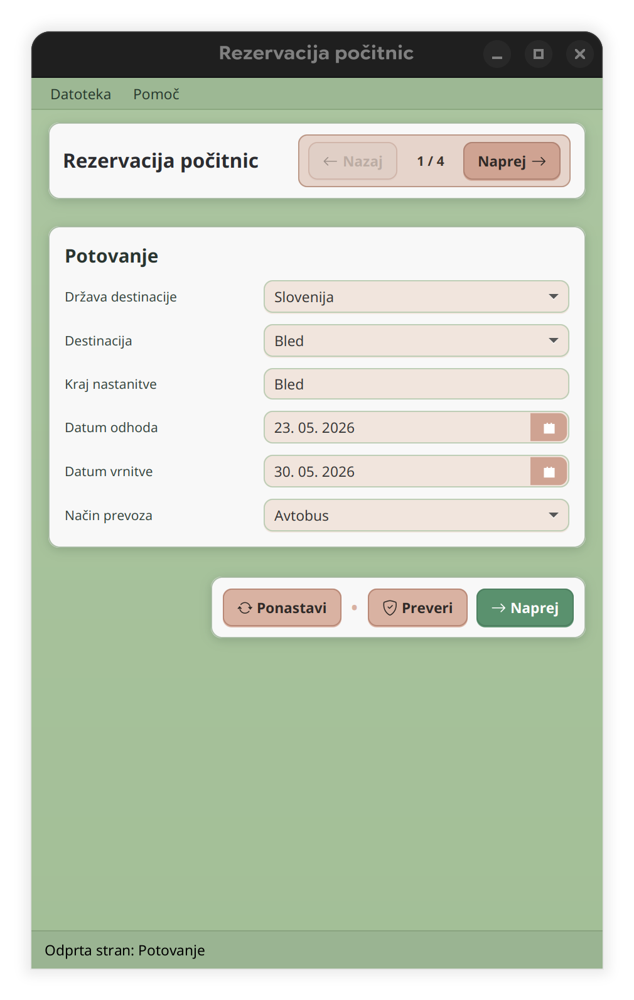
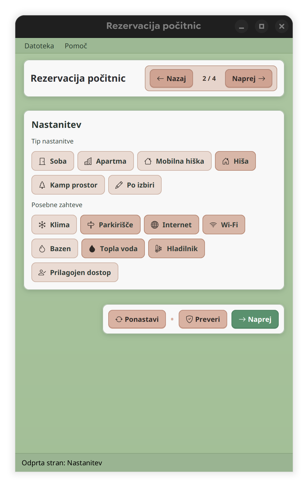
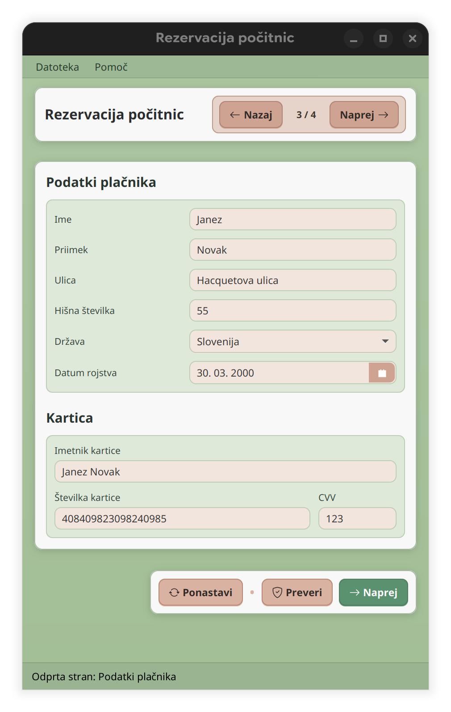
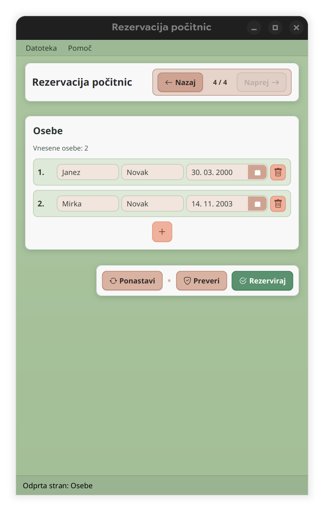
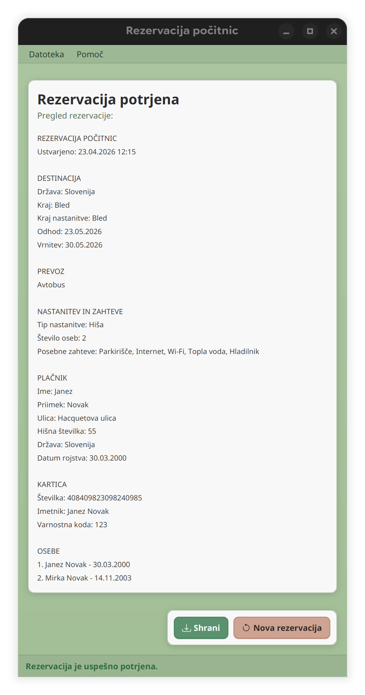

# Rezervacija počitnic

A JavaFX desktop application for managing holiday reservations.

## Features

- **Multi-step reservation form** with 4 pages:
  - **Potovanje** – select destination country, city, accommodation location, travel/return dates, and transport mode
  - **Nastanitev** – choose accommodation type (room or custom) and select special requirements (AC, parking, Wi-Fi, pool, etc.)
  - **Podatki plačnika** – enter payer personal info, address, and credit card details
  - **Osebe** – dynamically add/remove travel participants
- **Form validation** with visual feedback and error highlighting on every page
- **Save & Open** reservation reports as `.txt` files via the menu bar
- **Confirmation screen** shown after successful reservation
- **Modern UI** styled with [BootstrapFX](https://github.com/kordamp/bootstrapfx) and [Ikonli](https://github.com/kordamp/ikonli) icons

## Screenshots

### 1. Travel details (Potovanje)

Select the destination country and city, set travel dates, and pick a transport mode.

### 2. Accommodation (Nastanitev)

Choose the accommodation type and mark any special requirements.

### 3. Payer details (Podatki plačnika)

Enter the payer's personal information, address, and credit card details.

### 4. Participants (Osebe)

Add or remove travel participants with name, surname, and date of birth.

### 5. Confirmation

Successful reservation confirmation screen.

